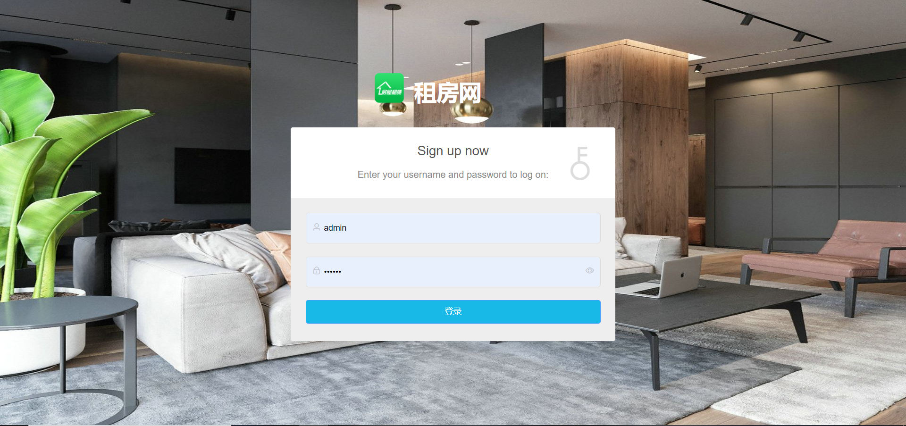
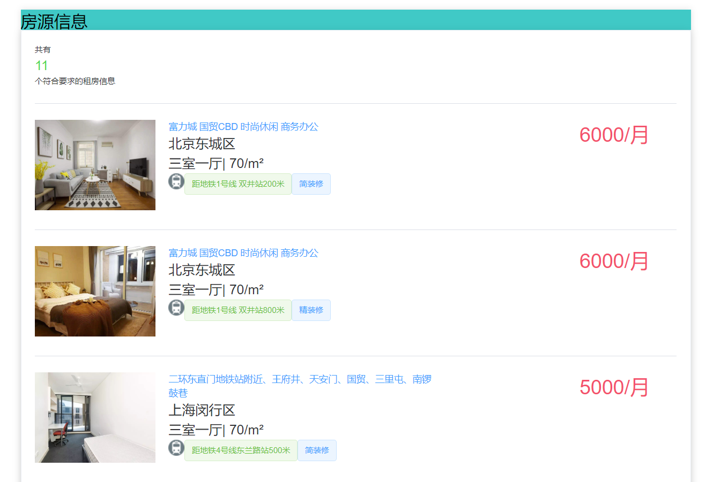
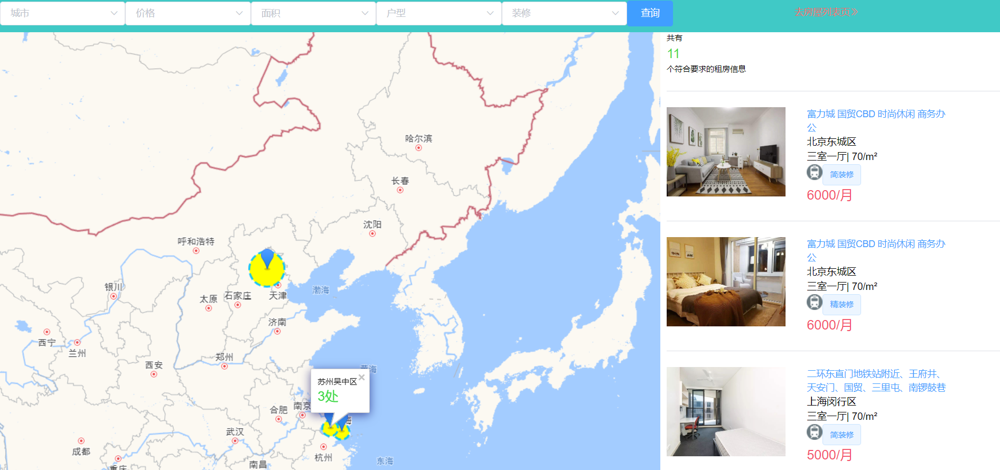
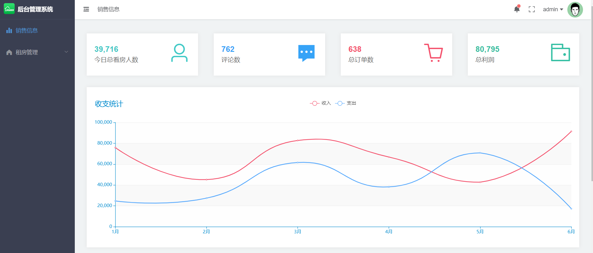

# house_rent
基于Vue+Element-UI实现页面搭建，调用百度地图api实现地图找房功能，数据库使用mysql，并将房源数据导入ElasticSearch全文搜索引擎中，方便用户检索房源

# 技术栈

前端：vue2.0 + Element-UI + vue-router + vuex + axios + ES6 
后端：SpringBoot + jpa + SpringData-ElasticSearch

## 简介

1. Vue + Element-UI实现首页广告房源示，房源列表，房源详情，地图找房
2. vuex + webStorage 实现了不同权限登录功能,axios拦截,配合路由钩子函数实现权限控制、登录、登出功能

## 预览
### 用户登录
        
  
### 管理员登录



## 经验

1. 事先一定要先想好整个页面组成，怎样去分组件开发，这样在开发阶段会事半功倍

2. 本质上vuex只是一个全局变量,所以刷新路由,state数据会清空,可配合webStorage实现响应式

3. 所有webStorage存储应该通过dispatch操作

4. 只做数据渲染,不做数据修改,不需要用vuex

5. 简单的父子通信不需要用vuex

## 待完成

1. ElasticSearch推荐房源功能


## Build Setup

``` bash
# install dependencies
npm install

# serve with hot reload at localhost:1322
npm run dev

# build for production with minification
npm run build


